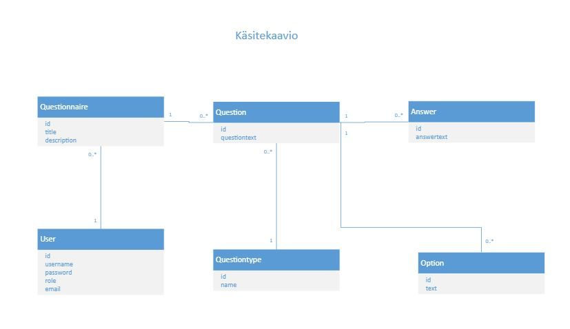
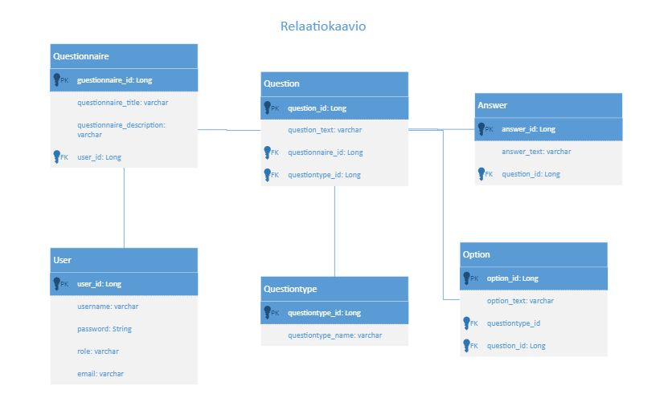

# questionnaire

Git branch ohje:

1. tee branch:
git checkout -b omabranchinnimi
kun teet yllämainitun, niin siirryt samoin tein uuteen, luomaasi branchiin.

2. Tee ja commitoi ja pushaa muutoksia normaalisti branchissasi.

3. Kun haluat mergetä masteriin oman branchisi:
````
git status (jotta varmistat, että kaikki haluamasi muutokset on commitoitu branchiisi)
git checkout master
git pull
git checkout omabranchinnimi
git merge master
(jos tulee conflikti niin hoida tässä)
git push (että muutokset menee githubbiin omaan branchiisi)
git checkout master
git merge omabranchinnimi
git push (nyt branch ja sen muutokset ovat masterissa ja githubissa)
````
VALMISTA!


Sprintti1 vaatimukset: 

V2 Kyselyyn annetut yksittäiset vastaukset voi tallentaa. 

V4 Kyselyn kysymykset voi hakea. 

V5 Kyselyyn voi lisätä kysymyksiä. 





